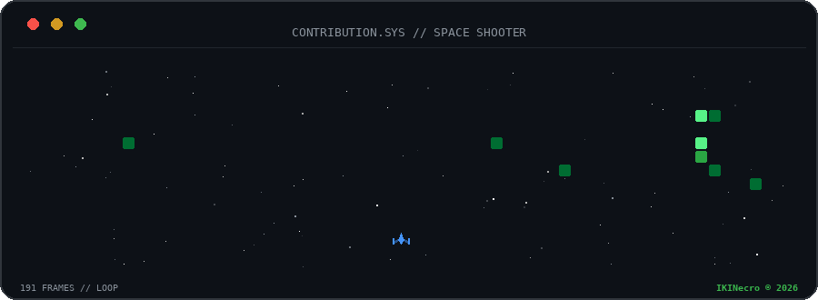

---

---

 

<picture>
  <source media="(prefers-reduced-motion: reduce)" srcset="assets/console_frame.png"/>
  
</picture>

---

 

<table>
<tr>
<td width="50%"></td>
<td width="50%"></td>
</tr>
<tr>
<td></td>
<td></td>
</tr>
<tr>
<td></td>
<td></td>
</tr>
</table>

---

 

 
 

