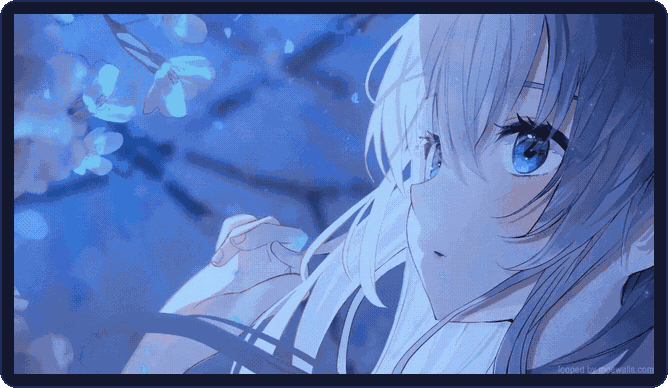

 

<picture>
  <source media="(prefers-reduced-motion: reduce)" srcset="assets/console_frame.png"/>
  
</picture>

 

 

 

<picture>
  <source media="(prefers-reduced-motion: reduce)" srcset="assets/connect_frame.png"/>
  
</picture>
