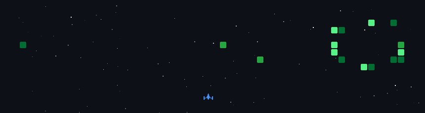

<div align="center">


</div>

---

## `$ whoami`

```ansi
                   `-`                    ┌────────────────────────────────────────────┐
                  .o+`                   │ jawa@penguin│
                 `ooo/                   └────────────────────────────────────────────┘
                `+oooo:                   ● ● ● ● ● ● ● ● ● ● ● ● ● ● ● ● 
               `+oooooo:                 ┌────────────────────────────────────────────┐
               -+oooooo+:                    OS ├→ Debian GNU/Linux 12 (bookworm) aarch64
             `/:-:++oooo+:               Kernel ├→ 6.6.76-08024-gb30cb4a129c2
            `/++++/+++++++:                Pkgs ├→ 1155 (dpkg)
           `/++++++++++++++:              Shell ├→ bash 5.2.15
          `/+++ooooooooooooo/`              WM ├→ Hyprland + celestia-shell
         ./ooosssso++osssssso+`          Theme ├→ Adwaita-dark [GTK3]
        .oossssso-````/ossssss+`           GPU ├→ Virtio 1.0 (spek kentang approved)
       -osssssso.      :ssssssso.          Mem └→ 1008MiB / 2787MiB
      :osssssss/        osssso+++.      ├────────────────────────────────────────────┤
     /ossssssss/        +ssssooo/-       Stack ├→ JS · PHP · Shell · HTML
   `/ossssso+/:-        -:/+osssso+-     Focus ├→ terminal tools · low-spec · ricing
  `+sso+:-`                 `.-/+oso:   Status └→ open to collaborate
 `++:.                           `-/+/  └────────────────────────────────────────────┘
 .`                                 `/  
```

---

<div align="center">

## `$ ls ~/stack`

<a href="https://skillicons.dev">
  
</a>
<br/>
<a href="https://skillicons.dev">
  
</a>


</div>

---

## `$ ./contribution-graph --game`

> contribution graph gua diubah jadi space shooter — setiap commit = peluru. regenerasi otomatis tiap hari jam 07:00 WIB.

<picture>
  <source media="(prefers-reduced-motion: reduce)" srcset="https://github-readme-stats.vercel.app/api?username=IKInecro&show_icons=true&bg_color=0D1117&border_color=1E3A2A&title_color=4ADE80&icon_color=22C55E&text_color=E6EDF3"/>
  
</picture>

<details>
<summary><code>$ cat game.log</code></summary>
<br>
powered by <a href="https://github.com/czl9707/gh-space-shooter">gh-space-shooter</a> · GitHub Actions daily cron · strategy <code>random</code> · fps 40
</details>

---

## `$ stats --verbose`


&nbsp;


---

## `$ ls -la ~/projects`

| repo | deskripsi | stack | ⭐ |
|------|-----------|-------|---|
| [**xampp-CLI**](https://github.com/IKInecro/xampp-CLI) | terminal-based XAMPP control panel | `JavaScript` |  |
| [**Arduino-cli-manager**](https://github.com/IKInecro/Arduino-cli-manager) | Arduino CLI dashboard buat spek kentang | `JavaScript` |  |
| [**nebula-ide**](https://github.com/IKInecro/nebula-ide) | IDE buatan sendiri | `JavaScript` |  |
| [**celestia-shell-setup**](https://github.com/IKInecro/celestia-shell-setup) | post-Hyprland setup, rice langsung jadi | `Shell` |  |
| [**RFID_absensi**](https://github.com/IKInecro/RFID_absensi) | sistem absensi berbasis RFID | `PHP` |  |
| [**idk-crud**](https://github.com/IKInecro/idk-crud) | CRUD test masuk kerjaan | `Blade` |  |

---

<div align="center">

## `$ ping ikinecro`

<a href="https://IKInecro.github.io"></a>
<a href="https://github.com/IKInecro"></a>


</div>


